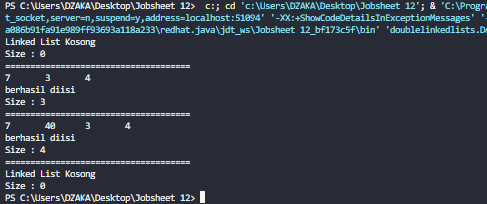
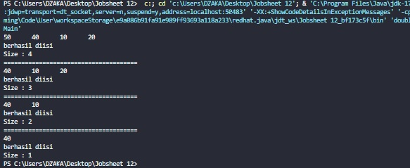
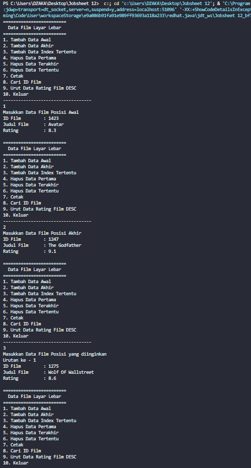

# JOBSHEET 12 : DOUBLE LINKED LIST 
## Nama : Muhammad Dzaka Murran Rusid
## Kelas/abs : 1F_D4-TI/18

### 12.1 Tujuan Praktikum
Setelah melakukan praktikum ini, mahasiswa mampu:

1. memahami algoritma double linked lists;
2. membuat dan mendeklarasikan struktur algoritma double linked lists;
3. menerapkan algoritma double linked lists dalam beberapa study case.

### 12.2 Kegiatan Praktikum 1
#### 12.2.1 Percobaan 1
Pada percobaan 1 ini akan dibuat class Node dan class DoubleLinkedLists yang didalamnya 
terdapat operasi-operasi untuk menambahkan data dengan beberapa cara (dari bagian depan linked 
list, belakang ataupun indeks tertentu pada linked list).
1. Perhatikan diagram class Node dan class DoublelinkedLists di bawah ini! Diagram class ini yang 
selanjutnya akan dibuat sebagai acuan dalam membuat kode program DoubleLinkedLists.
2. Buat paket baru dengan nama doublelinkedlists
3. Buat class di dalam paket tersebut dengan nama Node
4. Di dalam class tersebut, deklarasikan atribut sesuai dengan diagram class di atas.
5. Selanjutnya tambahkan konstruktor default pada class Node sesuai diagram di atas.
6. Buatlah sebuah class baru bernama DoubleLinkedLists pada package yang sama dengan node
7. Pada class DoubleLinkedLists tersebut, deklarasikan atribut sesuai dengan diagram class di atas.
8. Selajuntnya, buat konstruktor pada class DoubleLinkedLists sesuai gambar berikut.
9. Buat method isEmpty(). Method ini digunakan untuk memastikan kondisi linked list kosong.
10. Kemudian, buat method addFirst(). Method ini akan menjalankan penambahan data di bagian 
depan linked list.
11. Selain itu pembuatan method addLast() akan menambahkan data pada bagian belakang linked 
list.
12. Untuk menambakan data pada posisi yang telah ditentukan dengan indeks, dapat dibuat dengan 
method add(int item, int index)
13. Jumlah data yang ada di dalam linked lists akan diperbarui secara otomatis,sehingga dapat dibuat 
method size() untuk mendapatkan nilai dari size.
14. Selanjutnya dibuat method clear() untuk menghapus semua isi linked lists, sehingga linked lists
dalam kondisi kosong.
15. Untuk mencetak isi dari linked lists dibuat method print(). Method ini akan mencetak isi linked 
lists berapapun size-nya. Jika kosong akan dimunculkan suatu pemberitahuan bahwa linked lists
dalam kondisi kosong.
16. Selanjutya dibuat class Main DoubleLinkedListsMain untuk mengeksekusi semua method yang
ada pada class DoubleLinkedLists.
17. Pada main class pada langkah 16 di atas buatlah object dari class DoubleLinkedLists kemudian 
eksekusi potongan program berikut ini.
```java
package doublelinkedlists;

public class DoubleLinkedListMain {
    public static void main(String[] args) throws Exception{
        DoubleLinkedLists dll = new DoubleLinkedLists();
        dll.print();
        System.out.println("Size : "+dll.size());
        System.out.println("=====================================");
        dll.addFirst(3);
        dll.addLast(4);
        dll.addFirst(7);
        dll.print();
        System.out.println("Size : "+dll.size());
        System.out.println("=====================================");
        dll.add(40,1);
        dll.print();
        System.out.println("Size : "+dll.size());
        System.out.println("=====================================");
        dll.clear();
        dll.print();
        System.out.println("Size : "+dll.size());
    }
}

```

```java
package doublelinkedlists;
public class DoubleLinkedLists {
    Node head;
    int size;

    public DoubleLinkedLists(){
        head = null;
        size = 0;
    }

    public boolean isEmpty(){
        return head == null;
    }

    public void addFirst(int item){
        if(isEmpty()){
            head = new Node(null, item, null);
        }else{
            Node newNode = new Node(null, item, head);
            head.prev = newNode;
            head = newNode;
        }
        size++;
    }

    public void addLast(int item){
        if(isEmpty()){
            addFirst(item);
        }else{
            Node current = head;
            while (current.next != null){
                current = current.next;
            }
            Node newNode = new Node(current, item, null);
            current.next = newNode;
            size++;
        }
    }

    public void add(int item, int index) throws Exception{
        if(isEmpty()){
            addFirst(item);
        }else if(index<0 || index > size){
            throw new Exception("Nilai indeks di luar batas");
        }else{
            Node current = head;
            int i = 0;
            while (i<index){
                current = current.next;
                i++;
            }
            if(current.prev == null){
                Node newNode = new Node(null, item, current);
                current.prev = newNode;
                head = newNode;
            }else{
                Node newNode = new Node(current.prev, item, current);
                newNode.prev = current.prev;
                newNode.next = current;
                current.prev.next = newNode;
                current.prev = newNode;
            }
        }
        size++;
    }

    public int size(){
        return size;
    }

    public void clear(){
        head = null;
        size = 0;
    }

    public void print(){
        if(!isEmpty()){
            Node tmp = head;
            while(tmp != null){
                System.out.print(tmp.data + "\t");
                tmp = tmp.next;
            }
            System.out.println("\nberhasil diisi");
        }else{
            System.out.println("Linked List Kosong");
        }
    }
}

```

```java
package doublelinkedlists;
public class Node {
    int data;
    Node prev, next;

    Node(Node prev, int data, Node next){
        this.prev=prev;
        this.data=data;
        this.next=next;
    }
}
```

#### 12.2.2 Verifikasi Hasil Percobaan


#### 12.2.3 Pertanyaan Percobaan
1. Jelaskan perbedaan antara single linked list dengan double linked lists!

**Jawaban: Terletak pada pointernya, pada single linked list pointer hanya ada 1 yaitu next, sedangkan pada double linked list ada 2 pointer yakni next dan previous.**

2. Perhatikan class Node, didalamnya terdapat atribut next dan prev. Untuk apakah atribut tersebut?

**Jawaban: Untuk menunjukan kepada node berikutnya, dan atribut prev berguna untuk menunjuk kepada node sebelumnya**

3. Perhatikan konstruktor pada class DoubleLinkedLists. Apa kegunaan inisialisasi atribut head dan 
size seperti pada gambar berikut ini?
```java
public DoubleLinkedList(){
    head = null;
    size = 0;
}
```

**Jawaban: Dilakukan untuk menunjukkan bahwa head belum menunjuk ke node manapaun. Sedangkan size diinisialisasi untuk menyimpan jumlah data pada linked list.**

4. Pada method addFirst(), kenapa dalam pembuatan object dari konstruktor class Node prev 
dianggap sama dengan null?
```java
Node newNode = new Node(null, item, head);
```

**Jawaban: Karena operasi addFirst digunakan untuk penambahan data/node di awal atau di index0. Yang mana data yang ditambahkan ke node baru prevnya akan bernilai null karena pointer prev pada node tersebut tidak menunjukan ke node manapun.**

5. Perhatikan pada method addFirst(). Apakah arti statement head.prev = newNode ?

**Jawaban: Artinya adalah pointer prev pada data yang sudah ada pada linked list akan menunjukan ke node yang baru.**

6. Perhatikan isi method addLast(), apa arti dari pembuatan object Node dengan mengisikan 
parameter prev dengan current, dan next dengan null?
```java
Node newNode = new Node(current, item, null);
```

**Jawaban: Untuk menyimpan node yang sebelumnya, dimana jika dilakukan penambahan data pada index terakhir, maka pointer prev pda node yang ditambahkan akan menunjuk ke node yang sebelumnya.**

### 12.3 Kegiatan Praktikum 2
#### 12.3.1 Tahapan Percobaan
Pada praktikum 2 ini akan dibuat beberapa method untuk menghapus isi LinkedLists pada 
class DoubleLinkedLists. Penghapusan dilakukan dalam tiga cara di bagian paling depan, paling 
belakang, dan sesuai indeks yang ditentukan pada linkedLists. Method tambahan tersebut akan 
ditambahkan sesuai pada diagram class berikut ini.
1. Buatlah method removeFirst() di dalam class DoubleLinkedLists.
2. Tambahkan method removeLast() di dalam class DoubleLinkedLists.
3. Tambahkan pula method remove(int index) pada class DoubleLinkedLists dan amati hasilnya.
4. Untuk mengeksekusi method yang baru saja dibuat, tambahkan potongan kode program 
berikut pada main class.
```java
package doublelinkedlists;
public class Node {
    int data;
    Node prev, next;

    Node(Node prev, int data, Node next){
        this.prev=prev;
        this.data=data;
        this.next=next;
    }
}
```

```java
package doublelinkedlists;
public class DoubleLinkedLists {
    Node head;
    int size;

    public DoubleLinkedLists(){
        head = null;
        size = 0;
    }

    public boolean isEmpty(){
        return head == null;
    }

    public void addFirst(int item){
        if(isEmpty()){
            head = new Node(null, item, null);
        }else{
            Node newNode = new Node(null, item, head);
            head.prev = newNode;
            head = newNode;
        }
        size++;
    }

    public void addLast(int item){
        if(isEmpty()){
            addFirst(item);
        }else{
            Node current = head;
            while (current.next != null){
                current = current.next;
            }
            Node newNode = new Node(current, item, null);
            current.next = newNode;
            size++;
        }
    }

    public void add(int item, int index) throws Exception{
        if(isEmpty()){
            addFirst(item);
        }else if(index<0 || index > size){
            throw new Exception("Nilai indeks di luar batas");
        }else{
            Node current = head;
            int i = 0;
            while (i<index){
                current = current.next;
                i++;
            }
            if(current.prev == null){
                Node newNode = new Node(null, item, current);
                current.prev = newNode;
                head = newNode;
            }else{
                Node newNode = new Node(current.prev, item, current);
                newNode.prev = current.prev;
                newNode.next = current;
                current.prev.next = newNode;
                current.prev = newNode;
            }
        }
        size++;
    }

    public int size(){
        return size;
    }

    public void clear(){
        head = null;
        size = 0;
    }

    public void print(){
        if(!isEmpty()){
            Node tmp = head;
            while(tmp != null){
                System.out.print(tmp.data + "\t");
                tmp = tmp.next;
            }
            System.out.println("\nberhasil diisi");
        }else{
            System.out.println("Linked List Kosong");
        }
    }

    public void removeFirst() throws Exception{
        if(isEmpty()){
            throw new Exception("Linked List masih kosong, tidak dapat dihapus");
        }else if(size == 1){
            removeLast();
        }else{
            head = head.next;
            head.prev = null;
            size--;
        }
    }

    public void removeLast() throws Exception{
        if(isEmpty()){
            throw new Exception("Linked List masih kosong, tidak dapat dihapus!");
        }else if(head.next == null){
            head = null;
            size--;
            return;
        }
        Node current = head;
        while(current.next.next != null){
            current = current.next;
        }
        current.next = null;
        size--;
    }

    public void remove(int index) throws Exception{
        if(isEmpty() || index>=size){
            throw new Exception("Nilai indeks di luar batas");
        }else if(index==0){
            removeFirst();
        }else{
            Node current = head;
            int i = 0;
            while(i<index){
                current = current.next;
                i++;
            }
            if(current.next == null){
                current.prev.next = null;
            }else if(current.prev == null){
                current = current.next;
                current.prev = null;
                head = current;
            }else{
                current.prev.next = current.next;
                current.next.prev = current.prev;
            }
            size--;
        }
    }
}

```

```java
package doublelinkedlists;

public class DoubleLinkedListMain {
    public static void main(String[] args) throws Exception{
        DoubleLinkedLists dll = new DoubleLinkedLists();

        dll.addLast(50);
        dll.addLast(40);
        dll.addLast(10);
        dll.addLast(20);
        dll.print();
        System.out.println("Size : "+dll.size());
        System.out.println("======================================");
        dll.removeFirst();
        dll.print();
        System.out.println("Size : "+dll.size());
        System.out.println("======================================");
        dll.removeLast();
        dll.print();
        System.out.println("Size : "+dll.size());
        System.out.println("======================================");
        dll.remove(1);
        dll.print();
        System.out.println("Size : "+dll.size());
    }
}

```
#### 12.3.2 Verifikasi Hasil Percobaan


#### 12.3.3 Pertanyaan Percobaan
1. Apakah maksud statement berikut pada method removeFirst()?
```java
head = head.next;
head.prev = null;
```

**Jawaban: Ketika dilakukan penghapusan node pada index pertama, maka posisi head akan berpindah posisi ke node yang selanjutnya, dan pointer prev pada head akan bernilai null**

2. Bagaimana cara mendeteksi posisi data ada pada bagian akhir pada method removeLast()?

**Jawaban: Dengan melihat apakah pointer next pada node bernilai null atau tidak. Jika pointer next pada node bernilai null maka bisa dipastikan bahwa data tersebut berada pada bagian akhir.**

3. Jelaskan alasan potongan kode program di bawah ini tidak cocok untuk perintah remove!
```java
Node tmp - head.next;

head.next=tmp.next;
tmp.next.prev=head;
```

**Jawaban: Karena kode tersebut lebih cocok untuk removeFirst, dimana tmp menyimpan data setelah head, lalu head.next menyimpan data tmp.next.**

4. Jelaskan fungsi kode program berikut ini pada fungsi remove!
```java
current.prev.next = current.next;
current.next.prev = current.prey;
```

**Jawaban: Pointer next pada node sebelumnya akan menunjuk ke node selanjutnya, dan pointer prev pada node selanjutnya akan menunjuk ke node sebelumnya.**

### 12.4 Kegiatan Praktikum 3
#### 12.4.1 Tahapan Percobaan
Pada praktikum 3 ini dilakukan uji coba untuk mengambil data pada linked list dalam 3 
kondisi, yaitu mengambil data paling awal, paling akhir dan data pada indeks tertentu dalam 
linked list. Method mengambil data dinamakan dengan get. Ada 3 method get yang dibuat pada 
praktikum ini sesuai dengan diagram class DoubleLinkedLists.
1. Buatlah method getFirst() di dalam class DoubleLinkedLists untuk mendapatkan data pada 
awal linked lists.
2. Selanjutnya, buatlah method getLast() untuk mendapat data pada akhir linked lists.
3. Method get(int index) di buat untuk mendapatkan data pada indeks tertentu
4. Pada main class tambahkan potongan program berikut dan amati hasilnya!
```java
package doublelinkedlists;
public class Node {
    int data;
    Node prev, next;

    Node(Node prev, int data, Node next){
        this.prev=prev;
        this.data=data;
        this.next=next;
    }
}
```

```java
package doublelinkedlists;
public class DoubleLinkedLists {
    Node head;
    int size;

    public DoubleLinkedLists(){
        head = null;
        size = 0;
    }

    public boolean isEmpty(){
        return head == null;
    }

    public void addFirst(int item){
        if(isEmpty()){
            head = new Node(null, item, null);
        }else{
            Node newNode = new Node(null, item, head);
            head.prev = newNode;
            head = newNode;
        }
        size++;
    }

    public void addLast(int item){
        if(isEmpty()){
            addFirst(item);
        }else{
            Node current = head;
            while (current.next != null){
                current = current.next;
            }
            Node newNode = new Node(current, item, null);
            current.next = newNode;
            size++;
        }
    }

    public void add(int item, int index) throws Exception{
        if(isEmpty()){
            addFirst(item);
        }else if(index<0 || index > size){
            throw new Exception("Nilai indeks di luar batas");
        }else{
            Node current = head;
            int i = 0;
            while (i<index){
                current = current.next;
                i++;
            }
            if(current.prev == null){
                Node newNode = new Node(null, item, current);
                current.prev = newNode;
                head = newNode;
            }else{
                Node newNode = new Node(current.prev, item, current);
                newNode.prev = current.prev;
                newNode.next = current;
                current.prev.next = newNode;
                current.prev = newNode;
            }
        }
        size++;
    }

    public int size(){
        return size;
    }

    public void clear(){
        head = null;
        size = 0;
    }

    public void print(){
        if(!isEmpty()){
            Node tmp = head;
            while(tmp != null){
                System.out.print(tmp.data + "\t");
                tmp = tmp.next;
            }
            System.out.println("\nberhasil diisi");
        }else{
            System.out.println("Linked List Kosong");
        }
    }

    public void removeFirst() throws Exception{
        if(isEmpty()){
            throw new Exception("Linked List masih kosong, tidak dapat dihapus");
        }else if(size == 1){
            removeLast();
        }else{
            head = head.next;
            head.prev = null;
            size--;
        }
    }

    public void removeLast() throws Exception{
        if(isEmpty()){
            throw new Exception("Linked List masih kosong, tidak dapat dihapus!");
        }else if(head.next == null){
            head = null;
            size--;
            return;
        }
        Node current = head;
        while(current.next.next != null){
            current = current.next;
        }
        current.next = null;
        size--;
    }

    public void remove(int index) throws Exception{
        if(isEmpty() || index>=size){
            throw new Exception("Nilai indeks di luar batas");
        }else if(index==0){
            removeFirst();
        }else{
            Node current = head;
            int i = 0;
            while(i<index){
                current = current.next;
                i++;
            }
            if(current.next == null){
                current.prev.next = null;
            }else if(current.prev == null){
                current = current.next;
                current.prev = null;
                head = current;
            }else{
                current.prev.next = current.next;
                current.next.prev = current.prev;
            }
            size--;
        }
    }

    public int getFirst() throws Exception{
        if(isEmpty()){
            throw new Exception("Linked List kosong");
        }
        return head.data;
    }

    public int getLast() throws Exception{
        if(isEmpty()){
            throw new Exception("Linked List Kosong");
        }
        Node tmp = head;
        while (tmp.next != null){
            tmp = tmp.next;
        }
        return tmp.data;
    }

    public int get(int index) throws Exception{
        if(isEmpty() || index>=size){
            throw new Exception("Nilai indeks di luar batas");
        }
        Node tmp = head;
        for(int i=0;i<index;i++){
            tmp = tmp.next;
        }
        return tmp.data;
    }

}

```

```java
package doublelinkedlists;

public class DoubleLinkedListMain {
    public static void main(String[] args) throws Exception{
        DoubleLinkedLists dll = new DoubleLinkedLists();

        dll.print();
        System.out.println("Size: "+dll.size());
        System.out.println("=======================================");
        dll.addFirst(3);
        dll.addLast(4);
        dll.addFirst(7);
        dll.print();
        System.out.println("Size: "+dll.size());
        System.out.println("=======================================");
        dll.add(40,1);
        dll.print();
        System.out.println("Size: "+dll.size());
        System.out.println("=======================================");
        System.out.println("Data awal pada Linked Lists adalah: "+dll.getFirst());
        System.out.println("Data akhir pada Linked Lists adalah: "+dll.getLast());
        System.out.println("Data indeks ke-1 pada Linked Lists adalah: "+dll.get(1));
    }   
}

```

#### 12.4.2 Verifikasi Hasil Percobaan


#### 12.4.3 Pertanyaan Percobaan
1. Jelaskan method size() pada class DoubleLinkedLists!

**Jawaban: Method size() akan mereturn nilai 0 jika linked list dalam kondisi kosong atau tidak ada datanya**

2. Jelaskan cara mengatur indeks pada double linked lists supaya dapat dimulai dari indeks ke1!

**Jawaban: Dengan melakukan perulangan dan diinisialisasikan index sama dengan 1**

3. Jelaskan perbedaan karakteristik fungsi Add pada Double Linked Lists dan Single Linked Lists! 

**Jawaban: Pada single linked list operasi terbagi menjadi beberapa fungsi, sedangkan pada double linked list menjadi satu fungsi berdasarkan index.**

4. Jelaskan perbedaan logika dari kedua kode program di bawah ini!
(a) (b)

**Jawaban:**

**(a)Pada gambar A Jika atribut size atau jumlah data bernilai 0, maka akan mereturn true atau kondisi tersebut adalah true.Jika tidak maka kondisi tersebut adalah false.**

**(b)Sedangkan pada gambar B Jika head atau data pada index pertama bernilai null, maka kondisi tersebut adalah true.**

### 12.5 Tugas Praktikum
1. Buatlah sebuah program menggunakan double linked lists dengan pilihan menu sesuai dengan 
ilustrasi di bawah ini! Fitur pencarian harus menggunakan sequential search dan fitur 
pengurutan secara Descending mengimplementasikan (silakan pilih satu): bubble sort, selection 
sort, insertion sort, atau merge sort.

**Jawaban:**

```java
package tugas1;

public class Node {
        int nomor;
        String nama;
        Node prev, next;
    
        public Node(Node prev, int nomor, String nama, Node next) {
            this.prev = prev;
            this.nomor = nomor;
            this.nama = nama;
            this.next = next;
    
        }

}

```

```java
package tugas1;

public class DoubleLinkedList {
    Node head;
    int size;

    public DoubleLinkedList() {
        head = null;
        size = 0;
    }

    public boolean isEmpty(){
        return head == null;
    }
    public void addFirst(int id, String judulFilm, double rating){
        if (isEmpty()){
            head  = new Node(null, id, judulFilm, rating, null);
        }else{
            Node newNode = new Node(null, id, judulFilm, rating, head);
            head.prev = newNode;
            head = newNode;
        }
        size++;
    }
    public void addLast(int id, String judulFilm, double rating){
        if (isEmpty()){
            addFirst(id, judulFilm, rating);
        }else{
            Node current = head;
            while (current.next != null){
                current = current.next;
            }
            Node newNode = new Node(current, id, judulFilm, rating, null);
            current.next = newNode;
            size++;
        }
    }
    public void add(int id, String judulFilm, double rating, int index) throws Exception {
        if (isEmpty()){
            addFirst(id, judulFilm, rating);
        }else if (index <0 || index > size){
            throw new Exception("Nilai indeks di luar batas");
        }else{
            Node current = head;
            int i = 0;
            while(i<index){
                current = current.next;
                i++;
            }
            if(current.prev == null){
                Node newNode = new Node(null, id, judulFilm, rating, current);
                current.prev = newNode;
                head = newNode;
            }else{
                Node newNode = new Node(current.prev, id, judulFilm, rating, current);
                newNode.prev = current.prev;
                newNode.next = current;
                current.prev.next = newNode;
                current.prev = newNode;
            }
        }
        size++;
    }
    public void removeFirst() throws Exception{
        if(isEmpty()){
            throw new Exception("Linked List Masih kosong, tidak dapat dihapus!");
        }else if (size == 1){
            removeLast();
        }else{
            head = head.next;
            head.prev = null;
            size--;
        }
    }
    public void removeLast() throws Exception {
        if(isEmpty()){
            throw new Exception("Linked list masih kosong, tidak dapat dihapus!");
        }else if (head.next == null){
            head = null;
            size--;
            return;
        }
        Node current = head;
        while (current.next.next != null){
            current = current.next;
        }
        current.next = null;
        size--;
    }
    public void remove(int index) throws Exception {
        if (isEmpty() || index >= size){
            throw new Exception("Nilai indeks di luar batas");
        }else if (index == 0){
            removeFirst();
        }else{
            Node current = head;
            int i=0;
            while (i<index){
                current = current.next;
                i++;
            }
            if(current.next == null){
                current.prev.next = null;
            }else if(current.prev == null){
                current = current.next;
                current.prev = null;
                head = current;
            }else{
                current.prev.next = current.next;
                current.next.prev = current.prev;
            }
            size--;
        }
    }
    public void print(){
        System.out.println("----------------------");
        System.out.println("Data Saat Ini Menjadi"); 
        if(!isEmpty()){
            Node tmp = head;
            while (tmp != null){
                System.out.println("ID \t\t: "+tmp.id);
                System.out.println("Judul Film \t: "+tmp.judulFilm);
                System.out.println("Rating \t\t: "+tmp.rating);
                System.out.println();
                tmp = tmp.next;
            }
        }else{
            System.out.println("Linked List Kosong");
        }
    }
    public int findSeqSearch(int cari){
        Node tmp = head;
        int posisi = -1;
        int index = 0;
        while (tmp != null){
            if(tmp.id == cari){
                posisi = index;
                break;
            }
            index++;
            tmp = tmp.next;
        }
        return posisi;
    }
    public void tampilPosisi(int x, int pos){
        if(pos != -1){
            System.out.println("ID\t\t: "+ x +" ditemukan pada indeks "+pos);
        }else {
            System.out.println("ID\t\t"+ x +" tidak ditemukan");
        }
    }
    public void sort(){
        Node current = null, index = null;
        int tempID;
        String tempJD;
        Double tempRT;
        if (head == null) {
            return;
        } else {
            for (current = head; current.next != null; current = current.next) {
                for (index = current.next; index != null; index = index.next) {
                    if (current.rating < index.rating) {
                        tempRT = current.rating;
                        current.rating = index.rating;
                        index.rating = tempRT;
                        tempID = current.id;
                        current.id = index.id;
                        index.id = tempID;
                        tempJD = current.judulFilm;
                        current.judulFilm = index.judulFilm;
                        index.judulFilm = tempJD;
                    }
                }
            }
            print();
        }
    }
}

```

```java
package tugas1;

import java.util.Scanner;
public class DoubleLinkedListMain {

    public static void menu(){
        System.out.println("=========================");
        System.out.println("  Data Film Layar Lebar  ");
        System.out.println("=========================");
        System.out.println("1. Tambah Data Awal");
        System.out.println("2. Tambah Data Akhir");
        System.out.println("3. Tambah Data Index Tertentu");
        System.out.println("4. Hapus Data Pertama");
        System.out.println("5. Hapus Data Terakhir");
        System.out.println("6. Hapus Data Tertentu");
        System.out.println("7. Cetak");
        System.out.println("8. Cari ID Film");
        System.out.println("9. Urut Data Rating Film DESC");
        System.out.println("10. Keluar");
        System.out.println("-----------------------------------");
    }

    public static void main(String[] args) throws Exception {
       Scanner sc = new Scanner(System.in);
       Scanner sd = new Scanner(System.in);
       Scanner sb = new Scanner(System.in);
       
       DoubleLinkedList dll = new DoubleLinkedList();
        
       int pilih;
        do{
            menu();
            pilih = sc.nextInt();
            sc.nextLine();
    
            switch(pilih){
                case 1:
                    System.out.println("Masukkan Data Film Posisi Awal");
                    System.out.print("ID Film\t\t: ");
                    int id = sd.nextInt();
                    System.out.print("Judul Film\t: ");
                    String judulFilm = sc.nextLine();
                    System.out.print("Rating\t\t: ");
                    double rating = sb.nextDouble();
                    dll.addFirst(id, judulFilm, rating);
                    sc.nextLine();
                break;
                
                case 2:
                    System.out.println("Masukkan Data Film Posisi Akhir");
                    System.out.print("ID Film\t\t: ");
                    int idD = sd.nextInt();
                    System.out.print("Judul Film\t: ");
                    String judulFilmM = sc.nextLine();
                    System.out.print("Rating\t\t: ");
                    double ratingG = sb.nextDouble();
                    dll.addLast(idD, judulFilmM, ratingG);
                    sc.nextLine();
                break;
                
                case 3:
                    System.out.println("Masukkan Data Film Posisi yang diinginkan");
                    System.out.print("Urutan ke - ");
                    int idx = sd.nextInt();
                    System.out.print("ID Film\t\t: ");
                    int idDD = sd.nextInt();
                    System.out.print("Judul Film\t: ");
                    String judulFilmMM = sc.nextLine();
                    System.out.print("Rating\t\t: ");
                    double ratingGG = sb.nextDouble();
                    dll.add(idDD, judulFilmMM, ratingGG, idx);
                    sc.nextLine();
                break;
                
                case 4:
                    dll.removeFirst();
                    dll.print();
                break;
                
                case 5:
                    dll.removeLast();
                    dll.print();
                break;
                
                case 6:
                    System.out.println("hapus Data Film Posisi yang diinginkan");
                    System.out.print("Urutan ke - ");
                    int index = sd.nextInt();
                    dll.remove(index);
                    dll.print();
                break;
                
                case 7:
                    dll.print();
                break;
                
                case 8:
                    System.out.println("Cari ID Film Yang ingin dicari");
                    System.out.print("Masukkan ID\t: ");
                    int cari = sd.nextInt();
                    int idF = dll.findSeqSearch(cari);
                    dll.tampilPosisi(cari, idF);
                break;
                
                case 9:
                    System.out.println("Data Akan diurut secara DESC");
                    dll.sort();
                break;
                
                case 10:
                    System.exit(0);
                break;
            } 
        }while (pilih == 1 || pilih == 2 || pilih == 3 || pilih == 4 || pilih == 5 || pilih == 6 || pilih == 7 || pilih == 8 || pilih == 9 || pilih == 10);
    }
}

```

**Output:**


2. Implementasikan stack menggunakan double linked list dengan contoh kasus tumpukan buku 
perpustakaan sesuai dengan fitur-fitur yang ditunjukkan pada gambar di bawah ini!

**Jawaban:**

3. Buat program antrian vaksinasi menggunakan queue berbasis double linked list sesuai ilustrasi 
dan menu di bawah ini! (counter jumlah antrian tersisa di menu cetak(3) dan data orang yang 
telah divaksinasi di menu Hapus Data(2) harus ada)

```java
package tugas3;

public class Node {
        int nomor;
        String nama;
        Node prev, next;
    
        public Node(Node prev, int nomor, String nama, Node next) {
            this.prev = prev;
            this.nomor = nomor;
            this.nama = nama;
            this.next = next;
    
        }

}

```

```java
package tugas3;

public class DoubleLinkedList {
    Node head;
    int size;
    
    public DoubleLinkedList(){
        head = null;
        size = 1;    
    }
    public boolean isEmpty(){
        return head == null;
    }
    public void addLast(int nomor, String nama){
        if (isEmpty()){
            head  = new Node(null, nomor, nama, null);
        }else{
            Node current = head;
            while (current.next != null){
                current = current.next;
            }
            Node newNode = new Node(current, nomor, nama,null);
            current.next = newNode;
            size++;
        }
    }
    public void removeFirst() throws Exception{
        if(isEmpty()){
            throw new Exception("Linked List Masih kosong, tidak dapat dihapus!");
        }else if (size == 1){
            removeLast();
        }else{
            System.out.println(head.nama+"Sudah Divaksin");
            head = head.next;
            head.prev = null;
            size--;
        }
    }
    public void removeLast() throws Exception {
        if(isEmpty()){
            throw new Exception("Linked list masih kosong, tidak dapat dihapus!");
        }else if (head.next == null){
            System.out.println(head.nama+"Sudah Divaksin");
            head = null;
            size--;
            return;
        }
        Node current = head;
        while (current.next.next != null){
            current = current.next;
        }
        current.next = null;
        size--;
    }
    public void print(){
        System.out.println("+++++++++++++++++++++++++");
        System.out.println(" DAFTAR PENGANTRI VAKSIN ");
        System.out.println("+++++++++++++++++++++++++"); 
        System.out.println("| No\t| Nama"+"\t\t|");
        if(!isEmpty()){
            Node tmp = head;
            while (tmp != null){
                System.out.print("| "+tmp.nomor+"\t| "+tmp.nama+" "+"\t|\n");
                tmp = tmp.next;
            }
            System.out.println("\nSisa Antrian "+size);
        }else{
            System.out.println("Linked List Kosong");
        }
    }
}

```

```java
package tugas3;

import java.util.Scanner;
public class DoubleLinkedListMain {

    public static void menu(){
        System.out.println("==================================");
        System.out.println("PENGANTRI VAKSIN POLINEMA");
        System.out.println("+++++++++++++++++++++++++");
        System.out.println(" 1. Tambah Data Penerima Vaksin");
        System.out.println(" 2. Hapus Data Pengantri Vaksin");
        System.out.println(" 3. Daftar Penerima Vaksin");
        System.out.println(" 4. Keluar");
        System.out.println("==================================");
    }
    
    public static void main(String[] args) throws Exception  {
        Scanner sc = new Scanner(System.in);
        Scanner sd = new Scanner(System.in);
        
        DoubleLinkedList dll = new DoubleLinkedList();
        
        int pilih;
        do{
            menu();
            pilih = sc.nextInt();
            sc.nextLine();
    
            switch(pilih){
                case 1:
                    System.out.print("Nomor Antrian\t: ");
                    int nim = sd.nextInt();
                    System.out.print("Nama Penerima\t: ");
                    String nama = sc.nextLine();
                    dll.addLast(nim, nama);
                    sc.nextLine();
                break;
                
                case 2:
                    dll.removeFirst();
                    dll.print();
                break;
                
                case 3:
                    dll.print();
                break;
                
                case 4:
                    System.exit(0);
                break;
                
            } 
        }while (pilih == 1 || pilih == 2 || pilih == 3 || pilih == 4 );
    }
}
```
**Output:**


**Jawaban:**

4. Buatlah implementasi program daftar nilai mahasiswa yang terdiri dari nim, nama dan ipk
menggunakan double linked lists, bentuk program memiliki fitur seperti halnya nomor 1 dengan 
fitur pencarian melalui NIM dan pengurutan IPK secara descending. Class Mahasiswa wajib 
diimplementasikan dalam soal ini.


